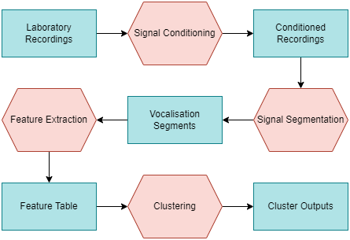

# Alphabetisation of Pempheris Adspersa Vocalisation

The New Zealand Bigeye (Pempheris Adspersa) is an elusive species of fish that generates a distinct vocalisation that can be characterised as a "clicking" or "popping" sound. These clicks can also come as a fused or unfused train of clicks, and typically occupy the frequency range 90-700Hz as can be seen in [Radford et al.](https://journals.biologists.com/jeb/article/218/6/940/14485/Vocalisations-of-the-bigeye-Pempheris-adspersa)

This project aims to extract an "alphabet" of Bigeye vocalisations from marine labratory recordings. These recordings are usually upwards of an hour and contain thousands of clicks. The process of deriving this alphabet is shown in the fiugre below:

